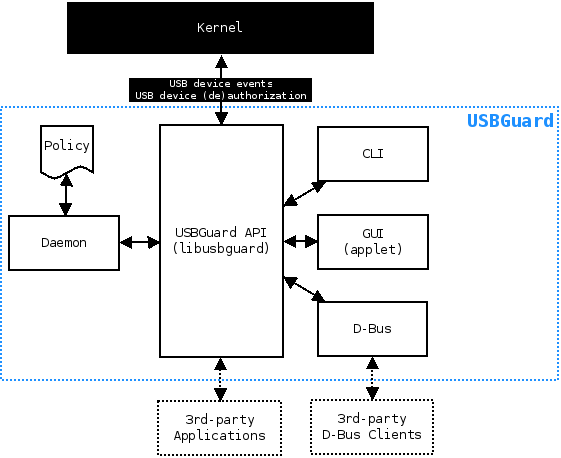

= Introduction =

USBGuard is a USB device whitelisting framework.

Features include:

* Rule-based policy engine based on a simple, human-readable rule language
* Daemon component with an IPC interface for dynamic interaction and policy enforcement
* Command line and graphical user interface
* D-Bus API
* C++ API including IPC client implemented in a shared library

.Component diagram

== Supported Operating Systems ==

Currently, USBGuard works only on Linux.
To enforce the user-defined policy, it uses the USB device authorization feature implemented in the Linux kernel since the year 2007.
Read link:https://www.kernel.org/doc/Documentation/usb/authorization.txt[this document] if you want to know more.

